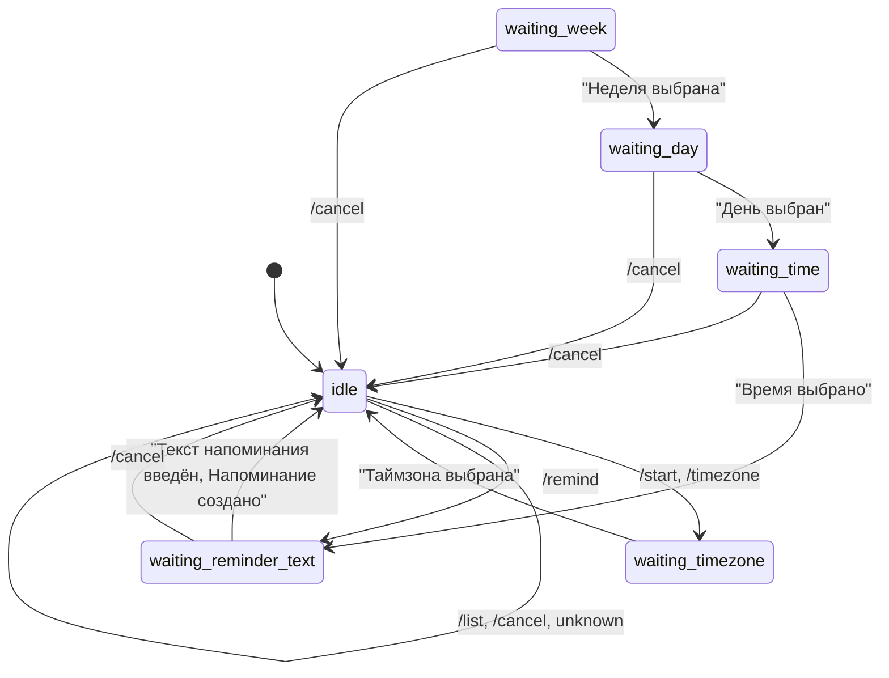

# InterviewScheduler Telegram Bot

InterviewScheduler — это Telegram-бот для создания и управления напоминаниями с использованием AWS Lambda, DynamoDB и AWS Scheduler.

## Возможности
- Создание напоминаний с выбором недели, дня, времени и текста
- Управление таймзоной пользователя
- Просмотр и удаление напоминаний
- Хранение данных в DynamoDB
- Масштабируемое выполнение через AWS Lambda

## Архитектура
- **Go** — основной язык
- **tgbotapi** — работа с Telegram Bot API
- **AWS SDK** — интеграция с AWS сервисами
- **DynamoDB** — хранение пользователей и напоминаний
- **State Machine** — управление этапами взаимодействия с пользователем

## Диаграмма состояний (State Machine)

## Быстрый старт
1. Склонируйте репозиторий
2. Установите зависимости: `go mod tidy`
3. Настройте переменные окружения для AWS и Telegram Bot Token
4. Запустите локально или задеплойте в AWS Lambda

## Структура проекта
- `internal/telegram/message.go` — основная логика state machine
- `pkg/` — вспомогательные функции (клавиатуры, обработка дат и времени)
- `storage/` — работа с базой данных

## Контакты
- Автор: @yourusername
- Вопросы и предложения: issues/pull requests приветствуются!
